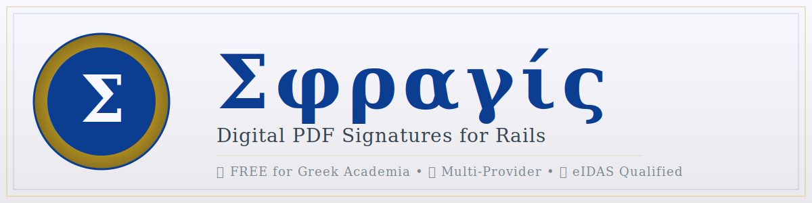

# Sphragis (Σφραγίς)

> **⚠️ EARLY DEVELOPMENT VERSION**
>
> This gem is in early development and has not been thoroughly tested in production environments.
> Use at your own risk and test extensively before deploying to production.

**Digital PDF Signatures for Rails Applications**

Sphragis (Σφραγίς - Greek for "seal") is a Rails Engine that provides multi-provider PDF digital signatures with interactive placement preview. Perfect for academic institutions and commercial use.

```ruby
gem 'sphragis'
```

## Features

- **🔐 Multi-Provider Support**: Hardware tokens (Fortify WebCrypto), cloud e-signatures (Harica), and more
- **🎯 Interactive Placement**: Drag-and-drop signature placement with PDF.js preview
- **🏛️ Greek Academic Focus**: FREE integration with Harica for Greek universities
- **💰 Cost-Effective**: Multiple FREE and low-cost options (€0-50)
- **🔒 High Security**: Support for qualified electronic signatures (eIDAS)
- **🎨 Rails Engine**: Drop-in integration with existing Rails apps
- **⚡ Simple API**: Easy programmatic and UI-based signing

## Quick Start

### Installation

Add to your `Gemfile`:

```ruby
gem 'sphragis'
```

Run:

```bash
bundle install
rails sphragis:install:migrations
rails db:migrate
```

Mount the engine in `config/routes.rb`:

```ruby
mount Sphragis::Engine, at: "/signatures"
```

### Configuration

Create `config/initializers/sphragis.rb`:

```ruby
Sphragis.configure do |config|
  # Choose your provider
  config.default_provider = :harica  # or :fortify_webcrypto, :itsme

  # Harica configuration (FREE for Greek academic institutions)
  config.harica_username = Rails.application.credentials.dig(:harica, :username)
  config.harica_password = Rails.application.credentials.dig(:harica, :password)
  config.harica_api_key = Rails.application.credentials.dig(:harica, :api_key)

  # OR Fortify WebCrypto (FREE software + ~€50 hardware token)
  # config.fortify_url = "https://localhost:31337"
  # config.fortify_certificate_id = "your_cert_id"
end
```

### Basic Usage

```ruby
# Programmatic signing
signer = Sphragis::PdfSigner.new("document.pdf", {
  provider: :harica,
  reason: "Official approval",
  location: "University of Aegean",
  contact: "admin@aegean.gr"
})
signed_path = signer.sign

# Interactive UI
redirect_to sphragis.preview_path(path: "document.pdf")
```

## Supported Providers

| Provider | Software Cost | Hardware Cost | Total Cost | Security Level |
|----------|---------------|---------------|------------|----------------|
| **Harica (Academic)** | FREE | €0 | **€0** | Qualified (eIDAS) |
| **Fortify WebCrypto** | FREE | €50 (one-time) | **€50** | Qualified* |
| **Itsme (Template)** | FREE | €0 | **€0** | Simple |

*With qualified certificate from CA like Harica

### 1. Harica - FREE for Greek Academia

Perfect for Greek universities and research institutions:

```ruby
config.default_provider = :harica
config.harica_username = "you@aegean.gr"
config.harica_password = Rails.application.credentials.dig(:harica, :password)
```

- ✅ **Cost**: €0 for .gr.ac domains
- ✅ **Security**: eIDAS qualified electronic signatures
- ✅ **Setup time**: 15 minutes
- 📚 **Documentation**: [PROVIDERS.md](doc/PROVIDERS.md)

### 2. Fortify WebCrypto - FREE Software + Hardware

For maximum security with hardware tokens:

```ruby
config.default_provider = :fortify_webcrypto
config.fortify_url = "https://localhost:31337"
```

- ✅ **Software**: FREE (MIT license)
- ✅ **Hardware**: YubiKey ~€50 (one-time)
- ✅ **Source**: https://github.com/PeculiarVentures/fortify-releases
- 📚 **Documentation**: [FORTIFY_WEBCRYPTO.md](doc/FORTIFY_WEBCRYPTO.md)

### 3. Custom Providers

Extend `BaseProvider` for your own signature service:

```ruby
module Sphragis::Providers
  class MyProvider < BaseProvider
    def sign(data)
      # Your implementation
    end
  end
end
```

See [PROVIDERS.md](doc/PROVIDERS.md) for details.

## Interactive UI

Sphragis includes a complete web interface for signature placement:

```ruby
# In your controller
def sign_document
  @document = Document.find(params[:id])
  redirect_to sphragis.preview_path(path: @document.pdf.path)
end
```

Features:
- 📄 PDF.js viewer
- 🖱️ Drag-and-drop signature placement
- 📏 Real-time coordinate preview
- 🔄 Provider selection dropdown
- ✅ Live signature preview

## API Documentation

### PdfSigner

```ruby
signer = Sphragis::PdfSigner.new(pdf_path, options)
signed_path = signer.sign
```

**Options:**
- `provider`: `:harica`, `:fortify_webcrypto`, `:itsme` (default: configured default)
- `reason`: Reason for signing (e.g., "Approved")
- `location`: Signing location (e.g., "Athens, Greece")
- `contact`: Contact info (e.g., "admin@example.com")
- `x`, `y`, `width`, `height`: Signature box coordinates (points)
- `page`: Page number (0-indexed)

### Configuration

```ruby
Sphragis.configure do |config|
  config.default_provider = :harica

  # Harica
  config.harica_username = "user@aegean.gr"
  config.harica_password = "secret"
  config.harica_api_key = "api_key"
  config.harica_certificate_id = "cert_id"
  config.harica_environment = "production"  # or 'sandbox'

  # Fortify WebCrypto
  config.fortify_url = "https://localhost:31337"
  config.fortify_certificate_id = "cert_id"

  # Itsme
  config.itsme_client_id = "client_id"
  config.itsme_client_secret = "secret"
  config.itsme_user_email = "user@example.com"
  config.itsme_environment = "production"
end
```

### Provider Factory

```ruby
# List available providers
Sphragis::ProviderFactory.available_providers
# => [:harica, :fortify_webcrypto]

# Create provider instance
provider = Sphragis::ProviderFactory.create(:harica)
provider.connect
signature = provider.sign(data)
provider.disconnect
```

## Cost Breakdown

### Greek Academic Institution (Recommended)

```
Sphragis gem: FREE
Harica: FREE (academic)
Total: €0
```

### Commercial with Hardware Token

```
Sphragis gem: FREE
Fortify WebCrypto: FREE
YubiKey: €50 (one-time)
Certificate: €0-200/year
Total: €50-250 first year
```

### Development/Testing

```
Sphragis gem: FREE
Simulated provider: FREE
Total: €0
```

See [LICENSING_SUMMARY.md](doc/LICENSING_SUMMARY.md) for complete details.

## Requirements

- Ruby 3.2+
- Rails 6.1+
- For Fortify WebCrypto:
  - Fortify app (FREE): https://github.com/PeculiarVentures/fortify-releases
  - Hardware token: YubiKey or similar (~€50)
- For Harica:
  - Greek academic email (.gr.ac)
  - Harica account (FREE)

## Testing

```bash
bundle exec rake test
```

All tests use Minitest with Mocha for mocking.

## Code Quality & Security

```bash
# Run RuboCop
bundle exec rubocop

# Security audit
bundle exec bundle-audit check
```

## Documentation

- [PROVIDERS.md](doc/PROVIDERS.md) - Provider comparison and configuration
- [FORTIFY_WEBCRYPTO.md](doc/FORTIFY_WEBCRYPTO.md) - Fortify setup guide
- [LICENSING_SUMMARY.md](doc/LICENSING_SUMMARY.md) - Complete cost breakdown
- [MULTIPLE_PROVIDERS.md](doc/MULTIPLE_PROVIDERS.md) - Multi-provider usage
- [LOGO.md](doc/LOGO.md) - Logo design and branding

## Logo & Branding

The Sphragis logo is inspired by ancient Greek σφραγιδόλιθοι (sealstones) - precious carved stones used for 3,000 years to authenticate documents. Just as ancient seals authenticated documents through physical impression, Sphragis authenticates digital documents through cryptographic signatures.

See [LOGO.md](doc/LOGO.md) for design details.

## Development Status

**Current Version**: 0.1.0 (Early Development)

**⚠️ Important Notes:**
- This gem is in early development
- Not yet tested in production environments
- API may change in future versions
- Test thoroughly before production use
- Contributions and feedback welcome

**Completed:**
- ✅ Multi-provider architecture
- ✅ Harica integration
- ✅ Fortify WebCrypto integration
- ✅ Interactive UI with PDF.js
- ✅ Minitest test suite
- ✅ RuboCop configuration
- ✅ Security audit setup

**Planned:**
- 🔄 Production testing and hardening
- 🔄 Additional provider support
- 🔄 Batch signing operations
- 🔄 Signature verification
- 🔄 Audit logging
- 🔄 Performance optimization

## Contributing

Contributions welcome! This gem is developed at the University of the Aegean.

1. Fork the repository
2. Create your feature branch (`git checkout -b feature/amazing-feature`)
3. Run tests (`bundle exec rake test`)
4. Run RuboCop (`bundle exec rubocop`)
5. Commit your changes (`git commit -am 'Add amazing feature'`)
6. Push to the branch (`git push origin feature/amazing-feature`)
7. Open a Pull Request

Please ensure:
- All tests pass
- RuboCop violations are resolved
- New features include tests
- Documentation is updated

## License

MIT License - See [LICENSE](LICENSE) for details.

## Author

**Michail Pantelakis**
- Email: mpantel@aegean.gr
- Institution: University of the Aegean
- GitHub: https://github.com/mpantel/sphragis

## Acknowledgments

- **Peculiar Ventures** for Fortify WebCrypto (FREE, open source)
- **HARICA** for FREE academic certificates
- **University of the Aegean** for supporting this project
- Ancient Greek craftsmen who created the original σφραγιδόλιθοι

## Disclaimer

**Sphragis is an independent open-source project.** We are NOT affiliated with, endorsed by, or sponsored by any of the third-party providers, services, or products mentioned in this documentation, including but not limited to:

- Peculiar Ventures (Fortify) • Harica • Yubico (YubiKey) • Nitrokey • ItsMe • OpenSC Project • Any certificate authorities or hardware manufacturers

All trademarks and product names are property of their respective owners. This gem provides integration code only. Users are responsible for complying with third-party terms of service and any associated costs.

## Support

- **Issues**: https://github.com/mpantel/sphragis/issues
- **Email**: mpantel@aegean.gr
- **Documentation**: See docs/ directory

## Related Projects

- [Fortify by Peculiar Ventures](https://github.com/PeculiarVentures/fortify)
- [HARICA](https://www.harica.gr)
- [Prawn PDF](https://github.com/prawnpdf/prawn)
- [PDF.js](https://mozilla.github.io/pdf.js/)

---

**Σφραγίς** - Bringing 3,000 years of document authentication tradition to the digital age 🔏
